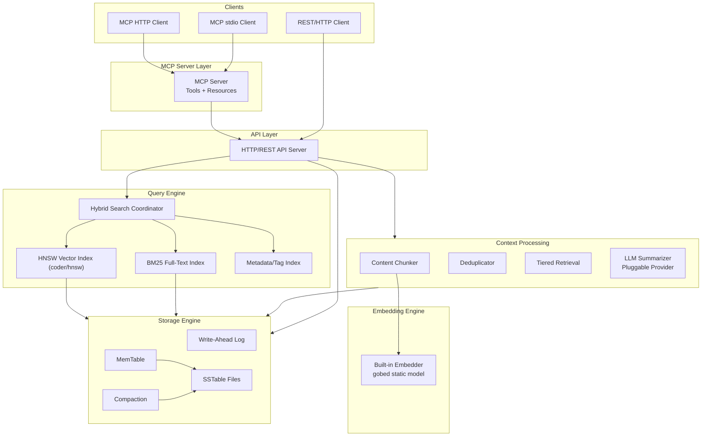

# LaightDB: AI Context Database in Go

## Architecture Overview



## Key Design Decisions

- **Go version**: 1.26+ (Green Tea GC, `new(expr)`, `sync.WaitGroup.Go`, `testing/synctest`)
- **TDD mandatory**: Write or extend **failing tests before** production code for each feature; refactor with tests green. Prefer table-driven tests, `t.Parallel()`, `t.Context()`, `testing/synctest` for concurrency (WAL, flush, compaction, MCP).
- **Coverage**: Aim for **high coverage on all packages** (target **80%+** statement coverage per package where feasible; storage/index packages should be **85%+**). No new exported API without tests. Run `go test -race ./...` before merge.
- **Build order**: Infrastructure-first (storage -> indexing -> context -> API -> MCP)
- **HNSW**: Use `github.com/coder/hnsw` library (not built from scratch); `Node.Key` / `Node.Value`; `LoadSavedGraph` + `SavedGraph.Save()`
- **Serialization**: Custom binary encoding for ContextEntry (compact, fast)
- **Configuration**: Environment variables + CLI flags only (no config file, pure stdlib)
- **Token counting**: Heuristic estimator (chars/4 for English) -- no tokenizer dependency
- **Dev tools**: Managed via `tool` directive in go.mod (golangci-lint, air)
- **Docker**: Multi-stage Dockerfile + docker-compose with prod and dev profiles

## Test-Driven Development and Coverage

**Workflow (every phase)**

1. Define the public API or behavior (function signatures, error cases, edge cases).
2. Add **failing** `_test.go` tests (table-driven where possible): happy path, boundaries, errors, concurrency where relevant.
3. Implement minimal code to pass.
4. Refactor; keep tests green. Add regression tests for any bugfix.
5. Run **`go test -race ./...`** and **`go test -cover ./...`** before considering the phase done.

**Coverage commands** (also in Makefile)

```bash
go test -cover ./...
go test -coverprofile=coverage.out ./...
go tool cover -func=coverage.out          # per-function %
go tool cover -html=coverage.out -o=coverage.html
```

**Per-package expectations**

| Area | Minimum focus |
|------|----------------|
| `internal/storage` | Round-trip codec, WAL replay, MemTable flush, SSTable read/write, compaction correctness, crash-recovery scenarios |
| `internal/index` | BM25 scores vs known corpus, RRF merge, metadata filters, vector index insert/search (coder/hnsw) |
| `internal/context` | Chunk boundaries, dedup hash + similarity, tiered projection |
| `internal/summarize` | `httptest.Server` mocking provider APIs; noop always works offline |
| `internal/server` | Every HTTP route: status codes, JSON, error bodies |
| `internal/mcp` | Tool handlers with fake or in-memory store; **stdio E2E**: store → search → get |

**Integration / E2E**

- **HTTP**: `httptest` or loopback `net/http` client against real mux.
- **MCP**: Dedicated test that starts MCP server over memory transport or subprocess stdio with scripted JSON-RPC (per SDK patterns), asserting `store_context` / `search_context` / `get_context` (see README implementation gate).

**What not to do**

- No `testify` / `gomock` (per [AGENTS.md](AGENTS.md)); use stdlib `testing` and hand-written fakes.
- Do not skip tests for “simple” helpers — small pure functions are cheap to test and catch regressions.

## Data Model

Each stored context entry:

```go
type ContextEntry struct {
    ID          string            // UUID
    Collection  string            // Namespace/grouping
    Content     string            // Raw content
    ContentType string            // "code", "conversation", "doc", "kv"
    Summary     string            // Auto-generated or provided summary
    Chunks      []Chunk           // Semantic chunks with embeddings
    Metadata    map[string]string // Tags, source, language, etc.
    Embedding   []float32         // 1024-dim from gobed
    CreatedAt   time.Time
    UpdatedAt   time.Time
    TokenCount  int               // Estimated token count
}
```

## Binary Serialization Format

ContextEntry is serialized to `[]byte` for the storage engine using a custom binary codec:

```
[1-byte version][field-tag + varint-length + data]...
```

- String fields: `[tag][varint length][utf8 bytes]`
- Float32 slices (embeddings): `[tag][varint count][4 bytes per float, little-endian]`
- Map fields: `[tag][varint pair-count][key-len][key][val-len][val]...`
- Time fields: `[tag][8-byte unix nanos]`
- Implement as `internal/storage/codec.go` with `Encode(entry) []byte` and `Decode(data []byte) (ContextEntry, error)`

## Key Dependencies

| Dependency | Purpose |
|---|---|
| `github.com/modelcontextprotocol/go-sdk/mcp` | Official MCP SDK (stdio + streamable HTTP) |
| `github.com/lee101/gobed` | Built-in text embeddings (1024-dim, static model, 119 MB weights) |
| `github.com/coder/hnsw` | HNSW vector index (in-memory, pure Go, persist/load) |
| `github.com/google/uuid` | UUID generation |
| `log/slog` | Structured logging (stdlib) |

Dev tools (tracked via `tool` directive in go.mod):

| Tool | Purpose |
|---|---|
| `github.com/golangci/golangci-lint/cmd/golangci-lint` | Linter (run via `go tool golangci-lint run`) |
| `github.com/air-verse/air` | Hot reload for dev Docker container |

Everything else (storage engine, BM25, chunking, binary codec) is built from scratch using stdlib.

## Go 1.26 Features to Leverage

- **`new(expr)`**: Use `new(42)` syntax for pointer-to-value initialization (e.g., serialization, optional fields)
- **`sync.WaitGroup.Go`** (Go 1.25+): Use instead of manual `wg.Add(1); go func() { defer wg.Done(); ... }()` for background goroutines (compaction, async summarization)
- **`testing/synctest`** (Go 1.25+): Use for concurrent tests -- WAL, MemTable flush, compaction, background summarization. Virtual time, deterministic goroutine synchronization.
- **`T.Context`** (Go 1.24+): Use `t.Context()` in tests for automatic cancellation on test cleanup
- **Green Tea GC**: Enabled by default in 1.26 -- 10-40% less GC overhead, benefits the embedding cache and in-memory indexes
- **`go fix`**: Run `go fix ./...` as part of Makefile to modernize code
- **`tool` directive**: Track golangci-lint and air in go.mod -- no more `tools.go` or curl-pipe-sh

## Phase 0: Project Setup

1. **Initialize go.mod**: `go mod init github.com/gtrig/laightdb` with `go 1.26`. Add `tool` directives for `golangci-lint` and `air`.
2. **Update AGENTS.md**: Change `Go 1.22+` references to `Go 1.26+`. Add Go 1.26 idioms (use `sync.WaitGroup.Go`, `testing/synctest`, `T.Context`, `new(expr)`). Update approved dependencies to include `coder/hnsw`. Add Docker commands to Build & Test section.
3. **Update Cursor rules**: Update `go-conventions.mdc` with Go 1.26 patterns (`sync.WaitGroup.Go` for goroutine spawning, `testing/synctest` for concurrent tests, `T.Context()`, `new(expr)` for pointer init, `go tool` for dev tools).
4. **Create directory scaffold**: Ensure all `internal/` subdirectories and `cmd/laightdb/` exist.

## Phase 1: Foundation -- Storage Engine + Data Model

Build the custom LSM-tree storage engine. Implementation order within phase:

1. **Skip List** (`internal/storage/skiplist.go`): Sorted in-memory data structure. O(log n) insert/search. 32 max levels, p=0.25. Concurrent-safe with `sync.RWMutex`.
2. **Bloom Filter** (`internal/storage/bloom.go`): Probabilistic set membership. k=10 hash functions, double hashing. Used by SSTable for fast negative lookups.
3. **Binary Codec** (`internal/storage/codec.go`): Custom binary encoder/decoder for ContextEntry. Version-tagged fields, varint lengths, little-endian floats.
4. **WAL** (`internal/storage/wal.go`): Append-only binary log. Format: `[4-byte len][4-byte CRC32][1-byte type][key-len][val-len][key][value]`. `Sync()` after each write. Replay on recovery.
5. **MemTable** (`internal/storage/memtable.go`): Wraps skip list. Tracks byte size. Flushes to SSTable at threshold (default 4 MB). Supports tombstones for deletes.
6. **SSTable** (`internal/storage/sstable.go`): Writer (flush sorted entries to disk) + Reader (footer-first loading, binary search index, bloom filter check). Format: `[data blocks][index block][bloom filter][footer(16 bytes)]`.
7. **Engine** (`internal/storage/engine.go`): Orchestrates WAL + MemTable + immutable MemTables + SSTables. Provides `Put`, `Get`, `Delete`, `Scan` interface. Handles flush lifecycle and recovery.
8. **Compaction** (`internal/storage/compaction.go`): Background goroutine. Size-tiered strategy. K-way merge via `container/heap`. Tombstone removal. Atomic SSTable swap.

Each component: **tests committed before or with** the implementation; no merge without `_test.go` covering core behavior.

## Phase 2: Indexing -- Full-Text + Vector Search

1. **BM25 Inverted Index** (`internal/index/fulltext.go`): Custom tokenizer (lowercase, split whitespace/punctuation) + inverted index (`map[term][]Posting` where Posting = {docID, termFreq}). Okapi BM25 scoring (k1=1.2, b=0.75). Precomputed doc lengths + avgdl. Persisted to storage engine under `idx:ft:*` key prefix.
2. **HNSW Vector Wrapper** (`internal/index/vector.go`): Thin wrapper around `github.com/coder/hnsw`. Handles:
   - Inserting/deleting vectors by document ID (`Node.Key` / `Node.Value`)
   - Searching with library distance metric
   - Persisting via `LoadSavedGraph` + `SavedGraph.Save()` (not raw `Graph.Save` — see package docs)
   - Tests: mock or tempdir persistence, search recall on small fixed vectors
3. **Metadata Index** (`internal/index/metadata.go`): Inverted index on `key:value` pairs -> set of doc IDs. Stored under `idx:meta:*` key prefix.
4. **Hybrid Search** (`internal/index/hybrid.go`): Reciprocal Rank Fusion (RRF, k=60) combining BM25 + vector ranked lists. Pre-filter or post-filter by metadata. Returns merged top_k results.

## Phase 3: Context Processing -- Chunking, Dedup, Minimization

1. **Token Estimator** (`internal/context/tokens.go`): Heuristic `EstimateTokens(text string) int` using `len(text)/4` for English (adjustable per content type). No external tokenizer dependency.
2. **Chunker** (`internal/context/chunker.go`): Splits content into ~512-token chunks at paragraph (`\n\n`), then sentence, then hard-limit boundaries. 50-token overlap between adjacent chunks. Each chunk gets position index + parent entry ID.
3. **Deduplicator** (`internal/context/dedup.go`): Exact dedup via SHA-256 content hash. Near-dedup via embedding cosine similarity (threshold 0.95). Returns existing entry ID on duplicate.
4. **Tiered Retrieval** (`internal/context/tiered.go`): Three detail levels: `metadata` (ID, collection, type, metadata, token_count, timestamps), `summary` (+ summary text), `full` (+ content + chunks). Default search: `summary`.
5. **Embedding Engine** (`internal/embedding/engine.go`): Wraps `gobed.LoadModel()` + `model.Encode()`. Caches embeddings in memory (LRU by entry ID). Handles 119 MB model download on first run with clear error messages.

## Phase 4: Summarization -- Pluggable LLM

1. **Provider Interface** (`internal/summarize/provider.go`):
   ```go
   type Summarizer interface {
       Summarize(ctx context.Context, content string) (string, error)
   }
   ```
2. **OpenAI** (`internal/summarize/openai.go`): HTTP client to `POST /v1/chat/completions`. Uses `LAIGHTDB_OPENAI_API_KEY` env var.
3. **Anthropic** (`internal/summarize/anthropic.go`): HTTP client to `POST /v1/messages`. Uses `LAIGHTDB_ANTHROPIC_API_KEY` env var.
4. **Ollama** (`internal/summarize/ollama.go`): HTTP client to `POST /api/generate`. Uses `LAIGHTDB_OLLAMA_URL` env var (default `http://localhost:11434`).
5. **Noop** (`internal/summarize/noop.go`): No-op provider that stores empty summary. Used when no LLM configured.
6. Summarization runs async on ingest via background goroutine with buffered channel.

## Phase 5: API Layer -- HTTP Server

- **HTTP Server** (`internal/server/http.go`): REST API using Go 1.22 `net/http` mux.
- **Middleware** (`internal/server/middleware.go`): Request logging (slog), panic recovery, request ID.
- Endpoints:
  - `POST /v1/contexts` -- Store new context (auto-chunks, embeds, summarizes)
  - `GET /v1/contexts/{id}` -- Get context by ID (`?detail=summary|full`)
  - `POST /v1/search` -- Hybrid search (query, filters, top_k, detail level)
  - `DELETE /v1/contexts/{id}` -- Delete context
  - `GET /v1/collections` -- List collections
  - `POST /v1/collections/{name}/compact` -- Trigger compaction
  - `GET /v1/health` -- Health check
- JSON request/response bodies via `encoding/json`.
- Integration tests: start server, exercise full CRUD + search pipeline.

## Phase 6: MCP Server

Using `github.com/modelcontextprotocol/go-sdk/mcp`:

**Acceptance gate (blocks “usable” release):** With `LAIGHTDB_MCP_TRANSPORT=stdio`, automated test proves `store_context` → `search_context` → `get_context` (see [README.md](../../README.md)). Implement MCP tool handlers **test-first** where possible (handler table tests with fake `Store` interface).

- **MCP Server** (`internal/mcp/server.go`): Creates `mcp.Server`, registers all tools + resources. Accepts transport mode flag.
- **MCP Tools** (`internal/mcp/tools.go`):
  - `store_context` -- Store content with metadata, collection, type
  - `search_context` -- Hybrid search with query, filters, top_k, detail
  - `get_context` -- Retrieve by ID with detail level
  - `delete_context` -- Remove context
  - `list_collections` -- List available collections
  - `get_stats` -- Database statistics (entry count, collections, index sizes)
- **MCP Resources** (`internal/mcp/resources.go`): Expose collections as browsable resources at `laightdb://collections/{name}`.
- **Transports**: stdio via `mcp.StdioTransport{}`, HTTP via `mcp.NewStreamableHTTPHandler()`. Selected by `--mcp-transport=stdio|http` flag.

## Phase 7: Server Binary + Configuration

- **Main binary** (`cmd/laightdb/main.go`): Under 50 lines. Parses env/flags, wires all dependencies, starts HTTP + MCP servers.
- **Configuration** (`internal/config/config.go`): Reads from environment variables and CLI flags (stdlib `flag` package). No config file.

  | Env Var | Flag | Default | Purpose |
  |---|---|---|---|
  | `LAIGHTDB_DATA_DIR` | `--data-dir` | `./data` | Storage directory |
  | `LAIGHTDB_HTTP_ADDR` | `--http-addr` | `:8080` | HTTP listen address |
  | `LAIGHTDB_MCP_TRANSPORT` | `--mcp-transport` | `stdio` | MCP transport mode |
  | `LAIGHTDB_OPENAI_API_KEY` | -- | -- | OpenAI API key |
  | `LAIGHTDB_ANTHROPIC_API_KEY` | -- | -- | Anthropic API key |
  | `LAIGHTDB_OLLAMA_URL` | `--ollama-url` | `http://localhost:11434` | Ollama endpoint |
  | `LAIGHTDB_SUMMARIZER` | `--summarizer` | `noop` | Summarizer: openai, anthropic, ollama, noop |
  | `LAIGHTDB_MEMTABLE_SIZE` | `--memtable-size` | `4194304` | MemTable flush threshold (bytes) |
  | `LAIGHTDB_SEARCH_TOP_K` | `--search-top-k` | `10` | Default search results count |

- **Graceful shutdown**: Trap `SIGINT`/`SIGTERM`. Flush MemTable to SSTable. Close WAL. Persist HNSW graph. Close HTTP listener.
- **go.mod**: Module `github.com/gtrig/laightdb`, `go 1.26`, `tool` directives for golangci-lint and air.
- **Makefile** targets:
  - `build` -- `go build ./cmd/laightdb`
  - `test` -- `go test ./...`
  - `test-race` -- `go test -race ./...`
  - `test-cover` -- `go test -cover ./...`
  - `cover` -- `go test -coverprofile=coverage.out ./... && go tool cover -func=coverage.out`
  - `cover-html` -- `go test -coverprofile=coverage.out ./... && go tool cover -html=coverage.out -o coverage.html`
  - `vet` -- `go vet ./...`
  - `lint` -- `go tool golangci-lint run`
  - `fix` -- `go fix ./...`
  - `docker` -- `docker compose build`
  - `docker-up` -- `docker compose up -d`
  - `docker-dev` -- `docker compose --profile dev up laightdb-dev`
  - `clean` -- remove build artifacts and data dir (optional: `coverage.out`, `coverage.html`)
- **README.md**: Installation, quickstart, Docker usage, MCP setup for Cursor, environment variables, API reference.

## Phase 8: Docker

### Dockerfile (multi-stage)

```dockerfile
# --- Build stage ---
FROM golang:1.26-alpine AS builder
WORKDIR /src
COPY go.mod go.sum ./
RUN go mod download
COPY . .
RUN CGO_ENABLED=0 go build -ldflags="-s -w" -o /laightdb ./cmd/laightdb

# --- Production stage ---
FROM alpine:3.20
RUN apk add --no-cache ca-certificates
COPY --from=builder /laightdb /usr/local/bin/laightdb
EXPOSE 8080
VOLUME ["/data"]
ENV LAIGHTDB_DATA_DIR=/data
ENTRYPOINT ["laightdb"]
```

- Build stage compiles static binary (CGO_ENABLED=0)
- Production image is ~15 MB (Alpine + static binary)
- Data persisted via named volume at `/data`
- gobed model weights download into `/data/models/` on first run

### docker-compose.yml

Two profiles: default (production) and `dev` (development with live rebuild).

```yaml
services:
  laightdb:
    build:
      context: .
      dockerfile: Dockerfile
    ports:
      - "8080:8080"
    volumes:
      - laightdb-data:/data
    environment:
      - LAIGHTDB_DATA_DIR=/data
      - LAIGHTDB_HTTP_ADDR=:8080
      - LAIGHTDB_MCP_TRANSPORT=http
    restart: unless-stopped

  laightdb-dev:
    build:
      context: .
      dockerfile: Dockerfile.dev
    ports:
      - "8080:8080"
    volumes:
      - .:/src
      - go-cache:/go/pkg/mod
      - laightdb-dev-data:/data
    environment:
      - LAIGHTDB_DATA_DIR=/data
      - LAIGHTDB_HTTP_ADDR=:8080
      - LAIGHTDB_MCP_TRANSPORT=http
    profiles:
      - dev

volumes:
  laightdb-data:
  laightdb-dev-data:
  go-cache:
```

### Dockerfile.dev (development with live rebuild)

```dockerfile
FROM golang:1.26-alpine
WORKDIR /src
COPY go.mod go.sum ./
RUN go mod download
RUN go tool air --version  # installs air from go.mod tool directive
EXPOSE 8080
CMD ["go", "tool", "air", "-c", ".air.toml"]
```

- Uses `air` for hot reload on file changes
- Source mounted from host via volume
- Go module cache persisted in named volume
- Run with: `docker compose --profile dev up laightdb-dev`

### .air.toml (dev hot reload config)

```toml
[build]
cmd = "go build -o /tmp/laightdb ./cmd/laightdb"
bin = "/tmp/laightdb"
include_ext = ["go"]
exclude_dir = ["data", ".git", ".cursor"]
delay = 1000
```

### .dockerignore

```
.git
.cursor
data
*.md
!README.md
```

### Usage

```bash
# Production
docker compose up -d                          # Start LaightDB
docker compose logs -f                        # View logs

# Development (hot reload)
docker compose --profile dev up laightdb-dev  # Start with live rebuild

# Build only
docker compose build                          # Rebuild image
```

## Project Structure

```
LaightDB/
  cmd/
    laightdb/
      main.go                 # Entry point (<50 lines)
  internal/
    config/
      config.go               # Env + flag configuration
    storage/
      skiplist.go             # Skip list data structure
      skiplist_test.go
      bloom.go                # Bloom filter
      bloom_test.go
      codec.go                # Binary encoder/decoder for ContextEntry
      codec_test.go
      wal.go                  # Write-ahead log
      wal_test.go
      memtable.go             # In-memory sorted table
      memtable_test.go
      sstable.go              # On-disk sorted string tables
      sstable_test.go
      engine.go               # Storage engine orchestrator
      engine_test.go
      compaction.go           # Background SSTable merging
      compaction_test.go
    index/
      fulltext.go             # BM25 inverted index
      fulltext_test.go
      vector.go               # coder/hnsw wrapper
      vector_test.go
      metadata.go             # Metadata tag index
      metadata_test.go
      hybrid.go               # RRF hybrid search
      hybrid_test.go
    context/
      tokens.go               # Token count estimator
      store.go                # Context store (business logic)
      store_test.go
      chunker.go              # Content chunking
      chunker_test.go
      dedup.go                # Deduplication
      dedup_test.go
      tiered.go               # Tiered retrieval levels
    embedding/
      engine.go               # gobed wrapper + LRU cache
      engine_test.go
    summarize/
      provider.go             # Summarizer interface
      openai.go               # OpenAI implementation
      openai_test.go
      anthropic.go            # Anthropic implementation
      anthropic_test.go
      ollama.go               # Ollama implementation
      ollama_test.go
      noop.go                 # No-op fallback
      noop_test.go
    server/
      http.go                 # HTTP/REST API
      http_test.go            # Integration tests
      middleware.go           # Logging, recovery
    mcp/
      server.go               # MCP server setup
      server_test.go
      tools.go                # MCP tool definitions
      tools_test.go
      resources.go            # MCP resource definitions
      resources_test.go
      integration_test.go     # optional: stdio E2E or harness
  Dockerfile                  # Multi-stage production build
  Dockerfile.dev              # Dev image with air hot reload
  docker-compose.yml          # Prod + dev profiles
  .air.toml                   # Hot reload config
  .dockerignore
  go.mod
  go.sum
  Makefile
  README.md
```

## Implementation Order

The phases build on each other. Critical path: Storage Engine -> Indexing -> Context Processing -> API -> MCP -> Binary -> Docker. Within each phase, follow the numbered file order, but **tests lead implementation** (TDD). Do not advance a component without meaningful `_test.go` coverage and passing **`go test -race ./...`**. This document is the canonical implementation plan for the repository (also stored under `.cursor/plans/`).
