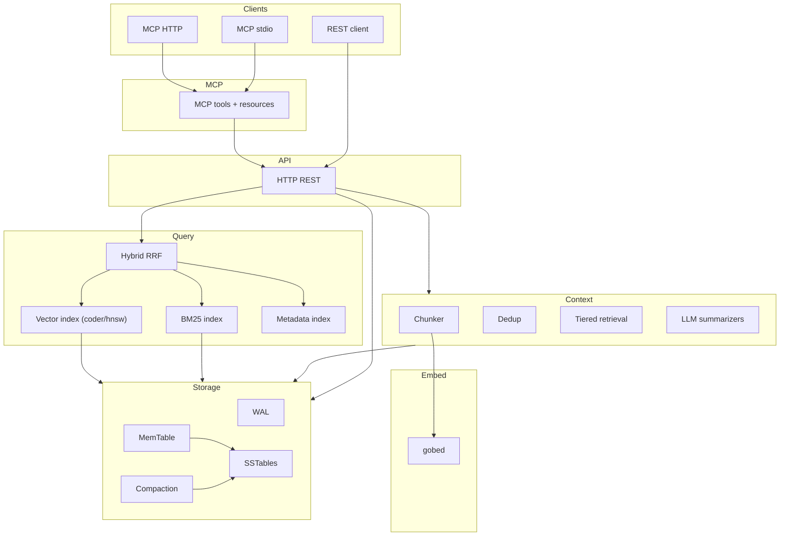

# LaightDB — Implementation Plan

**Module:** `github.com/gtrig/laightdb` · **Go:** 1.26+ · **Status:** Ready to begin Phase 0 (scaffold + `go.mod` tooling)

This document is the canonical implementation plan for the repository. Keep it in sync when scope changes.

---

## Readiness checklist (before coding)

| Item | Status |
|------|--------|
| [AGENTS.md](AGENTS.md) — stack, deps, conventions, API, Docker commands | Done |
| [.cursor/rules/](.cursor/rules/) — Go 1.26, storage, indexing (coder/hnsw), MCP, context | Done |
| [.cursor/skills/](.cursor/skills/) — LSM, MCP SDK, embeddings + vector search | Done |
| [go.mod](go.mod) — `go 1.26.1`, no app deps yet (add in Phase 0) | Minimal stub |
| `cmd/`, `internal/` packages | Create in Phase 0 |
| **coder/hnsw** — use `Node.Key` / `Node.Value`; `LoadSavedGraph` + `SavedGraph.Save()` | Documented in rules/skills |

**Phase 0 note:** [AGENTS.md](AGENTS.md) and Cursor rules are already aligned with this plan. Phase 0 is mainly: formal `go.mod` / `go.sum` with approved `require` and `tool` lines, directory scaffold, optional `golangci-lint` / `air` via `go get -tool`.

---

## Architecture



---

## Design decisions

- **Go 1.26+** — `new(expr)`, `sync.WaitGroup.Go`, `testing/synctest`, `t.Context()`, `tool` in `go.mod`, `go fix`.
- **Order:** Infrastructure-first — storage → indexing → context → summarize → HTTP → MCP → binary → Docker.
- **Vector search:** `github.com/coder/hnsw` — no custom HNSW implementation.
- **Record encoding:** Custom binary codec for `ContextEntry` in [internal/storage/codec.go](internal/storage/codec.go) (not JSON in the engine).
- **Config:** Environment variables + `flag` only — no YAML/TOML config file.
- **Token estimate:** Heuristic (e.g. `len/4`) — no tokenizer dependency.
- **Docker:** Multi-stage `Dockerfile`, `Dockerfile.dev` + `docker-compose.yml` (default prod, `dev` profile for air).

---

## Dependencies (to add in Phase 0 / as phases need them)

| Package | Role |
|---------|------|
| `github.com/modelcontextprotocol/go-sdk/mcp` | MCP server |
| `github.com/lee101/gobed` | Embeddings |
| `github.com/coder/hnsw` | HNSW ANN index |
| `github.com/google/uuid` | IDs |

**Dev tools** (`tool` in `go.mod`): `golangci-lint`, `air`.

Everything else (LSM, BM25, codec, HTTP handlers) — stdlib + project code.

---

## Phase 0 — Project setup

1. Add `require` / `tool` lines to [go.mod](go.mod); run `go mod tidy`.
2. Create tree: `cmd/laightdb/`, `internal/{config,storage,index,context,embedding,summarize,server,mcp}/`.
3. Optional: `.golangci.yml`, ensure `Makefile` targets match [AGENTS.md](AGENTS.md) Build section.

---

## Phase 1 — Storage engine

Order: skiplist → bloom → **codec** → WAL → MemTable → SSTable → engine → compaction.  
Each component: `*_test.go`, table-driven tests where practical.

---

## Phase 2 — Indexing

- `fulltext.go` — BM25 + inverted index (persist under `idx:ft:*` keys).
- `vector.go` — Wrapper around **coder/hnsw** (`LoadSavedGraph`, `SavedGraph.Save`, `Graph.Search` / `Add` / `Delete`).
- `metadata.go` — metadata inverted index (`idx:meta:*`).
- `hybrid.go` — RRF fusion (k=60) + filters.

---

## Phase 3 — Context layer

`tokens.go`, `store.go`, `chunker.go`, `dedup.go`, `tiered.go`, [internal/embedding/engine.go](internal/embedding/engine.go).

---

## Phase 4 — Summarization

Interface + OpenAI / Anthropic / Ollama HTTP clients + `noop` default. Async queue; use `context.Context` on `Summarize`.

---

## Phase 5 — HTTP API

`net/http` 1.22+ patterns, JSON bodies, middleware (slog, recovery, request ID).  
Endpoints match [AGENTS.md](AGENTS.md) including `POST /v1/collections/{name}/compact`.

---

## Phase 6 — MCP

Tools and resources per [AGENTS.md](AGENTS.md); stdio + streamable HTTP transports.

---

## Phase 7 — Binary + Makefile + README

Thin [cmd/laightdb/main.go](cmd/laightdb/main.go); [internal/config/config.go](internal/config/config.go) from env/flags; graceful shutdown (flush storage, **vector `SavedGraph.Save()`**, close listeners).

---

## Phase 8 — Docker

`Dockerfile` (Go **1.26**-alpine build), `Dockerfile.dev`, `docker-compose.yml`, `.air.toml`, `.dockerignore` — as outlined in the historical Cursor plan (prod + `dev` profile).

---

## Implementation order

```
Phase0 → Phase1 → Phase2 → Phase3 → Phase4 → Phase5 → Phase6 → Phase7 → Phase8
```

Within each phase, follow file order in the detailed Cursor plan if you need step-by-step granularity; this file stays the repo **overview**.

---

## Reference

- Agent instructions: [AGENTS.md](AGENTS.md).
- For long-form phase detail (WAL bytes, env/flag table, full Docker snippets), see the project’s archived Cursor plan file if present under `.cursor/plans/` — **this `PLAN.md` is the in-repo source of truth.**
